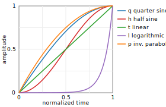

# Basic Effects

## trim — cut out a section

```bash
play test.wav trim start [length]
```

`trim` takes a start position and a *length*, not start and end.

```bash
play test.wav trim 0 5      # first 5 seconds
play test.wav trim 3 4      # 4 seconds starting at 3s
play test.wav trim 5        # skip the first 5 seconds
play test.wav trim -3       # last 3 seconds
play test.wav trim 00:01:30 # start at 1m30s
```

## reverse — play backwards

```bash
play test.wav reverse
```

Sox loads the whole file into memory to do this; large files are slow.

## fade — smooth edges

```bash
play test.wav fade [type] fade-in [duration] fade-out
```

The type can be `q` (quarter-sine, natural sounding), `t` (linear),
`h` (half-sine), `l` (logarithmic), or `p` (inverted parabola).
Omitting type defaults to linear.



```bash
play test.wav fade 1         # 1s linear fade-in, play to end
play test.wav fade q 2 0 2   # 2s fade-in, full duration, 2s fade-out
```

Duration `0` means "play to the natural end of the file."

## vol and gain — adjust volume

`vol` takes a multiplier; `gain` takes decibels:

```bash
play test.wav vol 0.5    # half amplitude
play test.wav vol 2.0    # double (can clip!)
play test.wav gain -6    # quieter by 6 dB
play test.wav gain 6     # louder by 6 dB (can clip!)
```

A rough guide: −6 dB ≈ half perceived loudness; +6 dB ≈ double.

> **sox_ng 14.5+:** `vol` accepts a second argument that enables a
> soft-clipping limiter so boosts don't hard-clip when they exceed
> 0 dBFS. See `man sox` for the exact argument. On legacy sox, `vol 2`
> clips; on sox_ng with the limiter, it shapes the peak instead.

## norm — automatic normalization

`norm` brings the peak sample to a target level (default 0 dBFS):

```bash
play test.wav norm       # peak to 0 dBFS
play test.wav norm -3    # peak to -3 dBFS (safer headroom)
```

To save the result: `sox test.wav out.wav norm -3`.

Like `gain`, `norm` has to find the peak before it can scale, so
it buffers the whole input in memory; large files are slow. There
is no streaming alternative for true peak normalization — a
limiter or compressor is the closest you'll get on a stream.

## stat — measure levels

Use `-n` as the output to discard audio and just print statistics:

```bash
sox test.wav -n stat     # linear amplitudes, whole file mixed to mono
sox test.wav -n stats    # dB levels, per-channel columns
```

`stats` is generally more useful: it reports in dB and breaks out
each channel separately. `stat` reports linear amplitude values,
which are harder to interpret. Both print to stderr.
